# Příručka k projektu: Blum Next App Template

Tato příručka je určená pro studenty středních škol, kteří se během dvoutýdenní praxe poprvé setkávají s vývojem webové aplikace.

Nemusíte předem znát Next.js, React, Git ani práci s databází. Cílem není porozumět hned všemu, ale bezpečně projít prvními kroky: připravit prostředí, spustit projekt, zorientovat se ve struktuře aplikace, udělat první malou změnu a odevzdat práci přes GitHub.

> Všechny příkazy v této příručce jsou psané pro Windows PowerShell.

---

## Obsah

- [1. Proč tento projekt děláme](#1-proč-tento-projekt-děláme)
- [2. Co se během praxe naučíte](#2-co-se-během-praxe-naučíte)
- [3. Co budete vytvářet](#3-co-budete-vytvářet)
- [4. Co není cílem](#4-co-není-cílem)
- [5. Plán práce na 2 týdny](#5-plán-práce-na-2-týdny)
- [6. Příprava vývojového prostředí](#6-příprava-vývojového-prostředí)
- [7. Příprava Visual Studio Code](#7-příprava-visual-studio-code)
- [8. Získání vlastní kopie projektu](#8-získání-vlastní-kopie-projektu)
- [9. Spuštění projektu](#9-spuštění-projektu)
- [10. Jak se zorientovat v projektu](#10-jak-se-zorientovat-v-projektu)
- [11. Mantine UI a návrh obrazovek](#11-mantine-ui-a-návrh-obrazovek)
- [12. První bezpečná změna](#12-první-bezpečná-změna)
- [13. Git a GitHub bez stresu](#13-git-a-github-bez-stresu)
- [14. Když něco nefunguje](#14-když-něco-nefunguje)
- [15. Jak pracovat s dokumentací](#15-jak-pracovat-s-dokumentací)
- [16. Kde hledat další informace](#16-kde-hledat-další-informace)
- [17. Tahák pojmů a příkazů](#17-tahák-pojmů-a-příkazů)

---

## 1. Proč tento projekt děláme

Během praxe si vyzkoušíte, jak vzniká jednoduchá webová aplikace od prvního spuštění až po odevzdání změn.

Nejde o to naučit se všechno dokonale. Cílem je pochopit základní principy:

- jak se pracuje s existujícím projektem,
- jak vznikají stránky webové aplikace,
- jak se skládá uživatelské rozhraní z komponent,
- jak se pracuje s jednoduchými daty,
- jak se ukládají změny pomocí Gitu,
- jak se postupuje po menších krocích.

Tyto dovednosti se používají při studiu softwarového inženýrství i v běžné práci vývojářů.

---

## 2. Co se během praxe naučíte

Během praxe si vyzkoušíte:

- nainstalovat nástroje potřebné pro vývoj,
- spustit existující projekt,
- najít důležité složky a soubory,
- upravit jednoduchou stránku,
- použít hotové UI komponenty,
- vytvořit jednoduchý formulář,
- uložit změny přes Git,
- odevzdat výsledek přes GitHub.

Nemusíte rozumět všem technickým detailům. Důležité je postupovat krok po kroku a umět vysvětlit, co jste vytvořili.

---

## 3. Co budete vytvářet

Během praxe budete vytvářet jednoduchou aplikaci **Bazar** v rámci Blogic Store.

Aplikace bude sloužit jako interní bazar pro spolupracovníky. Uživatelé v ní mohou nabízet věci k prodeji nebo k přenechání zdarma.

Příklady nabídek:

- nábytek,
- dětské věci,
- oblečení,
- elektronika,
- knihy,
- ostatní věci z domácnosti.

Aplikace nebude řešit samotnou platbu. Pomůže hlavně se zveřejněním nabídky a předáním kontaktu.

Podrobné zadání je v samostatném dokumentu `PRAXE.md`.

---

## 4. Co není cílem

Není cílem vytvořit dokonalou produkční aplikaci.

Není nutné:

- znát celý Next.js,
- rozumět všem částem šablony,
- navrhovat vlastní databázi,
- implementovat skutečné platby,
- vytvořit kompletní přihlašování,
- napsat vše od nuly bez pomoci dokumentace.

Důležité je dokončit menší funkční celek a rozumět tomu, co jste vytvořili.

---

## 5. Plán práce na 2 týdny

| Část praxe | Cíl |
|---|---|
| Den 1 | Připravit prostředí, spustit projekt, zorientovat se v projektu a udělat první malou změnu. |
| Zbytek 1. týdne | Připravit data, vytvořit přehled inzerátů a detail inzerátu. |
| Začátek 2. týdne | Vytvořit formulář pro nový inzerát, doplnit kategorie a stav inzerátu. |
| Konec 2. týdne | Dokončit povinnou část, upravit vzhled, vyzkoušet aplikaci a případně doplnit volitelná rozšíření. |

Na konci prvního týdne by aplikace měla umět zobrazit přehled inzerátů a detail vybraného inzerátu.

Na konci druhého týdne by měla být hotová povinná část zadání.

---

## 6. Příprava vývojového prostředí

Budete potřebovat:

- Visual Studio Code,
- Git,
- Node.js a npm,
- GitHub účet.

### Visual Studio Code

Visual Studio Code je editor, ve kterém budete projekt upravovat.

Postup:

1. Otevřete oficiální dokumentaci: <https://code.visualstudio.com/docs/setup/windows>
2. Nainstalujte Visual Studio Code pro Windows.

### Git

Git slouží k ukládání historie změn v projektu.

Postup:

1. Otevřete oficiální dokumentaci GitHubu: <https://docs.github.com/en/get-started/git-basics/set-up-git>
2. Nainstalujte Git pro Windows.
3. Po instalaci zavřete a znovu otevřete PowerShell.

Ověření:

```powershell
git --version
```

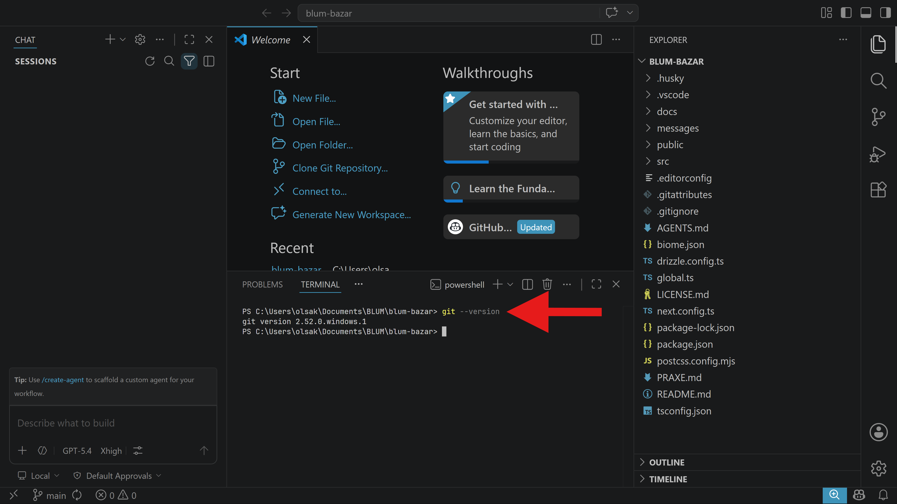

Nastavení jména a e-mailu:

```powershell
git config --global user.name "Marek Olsak"
git config --global user.email "marek.olsak@blogic.cz"
```

Použijte ideálně stejný e-mail, jaký máte na GitHubu.

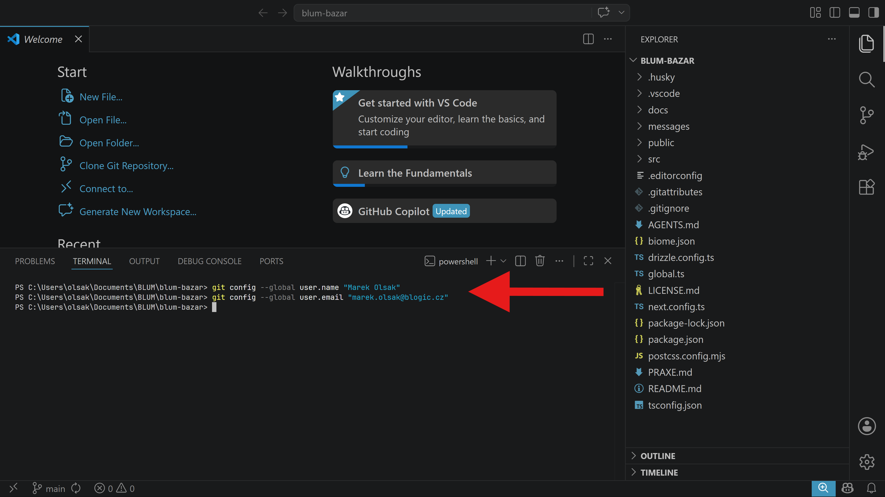

### Node.js a npm

Node.js umožňuje spustit projekt na vašem počítači. npm slouží ke stažení knihoven, které projekt používá.

Postup:

1. Otevřete oficiální stránku: <https://nodejs.org/en/download>
2. Stáhněte a nainstalujte LTS verzi pro Windows.
3. Po instalaci zavřete a znovu otevřete PowerShell.

Ověření:

```powershell
node -v
npm -v
```

Pokud příkaz není rozpoznán, nejčastěji pomůže zavřít a znovu otevřít PowerShell. Pokud problém trvá, požádejte o pomoc mentora.

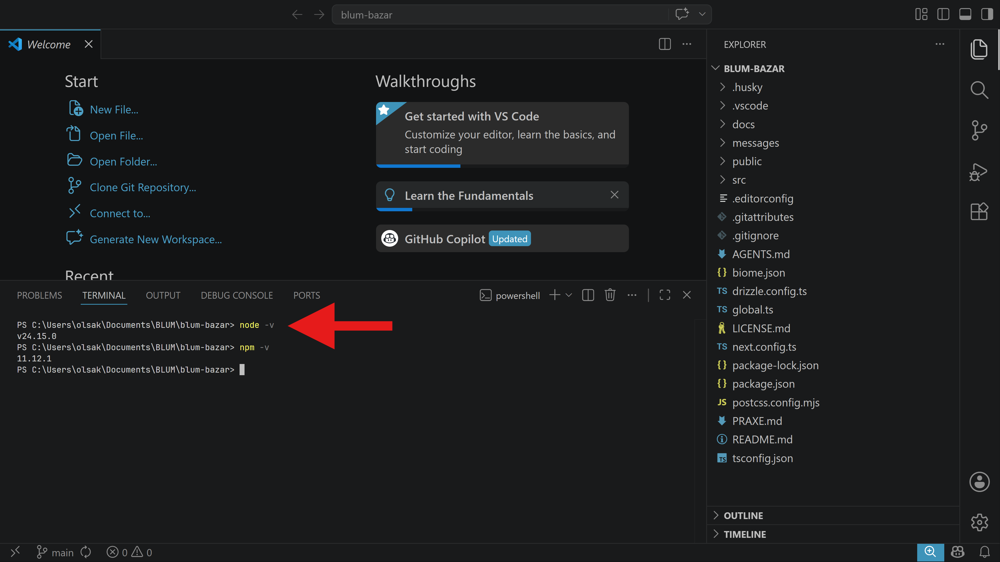

---

## 7. Příprava Visual Studio Code

Po otevření projektu ve Visual Studio Code:

1. Otevřete projektovou složku.
2. Nainstalujte doporučená rozšíření projektu.

V projektu může být připravený seznam doporučených rozšíření v souboru `.vscode/extensions.json`.

Doporučená rozšíření:

- **Biome** pro kontrolu a formátování kódu,
- **EditorConfig** pro sjednocené formátování,

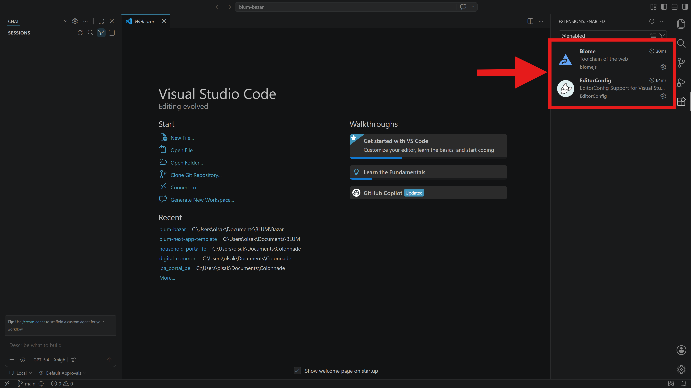

---

## 8. Získání vlastní kopie projektu

Budete pracovat ve svém vlastním repozitáři. Repozitář vyvoříte pomocí připravené šablony na GitHubu.

Postup:

1. Přihlaste se na GitHub a otevřete [repozitář](https://github.com/Marsiso/blum-next-app-template) se šablonou projektu.
2. Klikněte na tlačítka `Use this template` a `Create a new repository`.

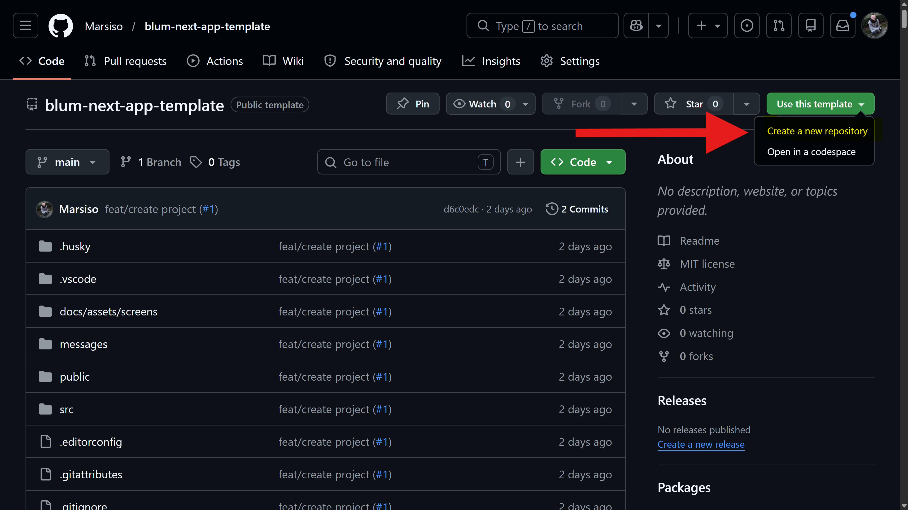

3. Vyplňte název repozitáře a klikněte na tlačítko `Create repository`.

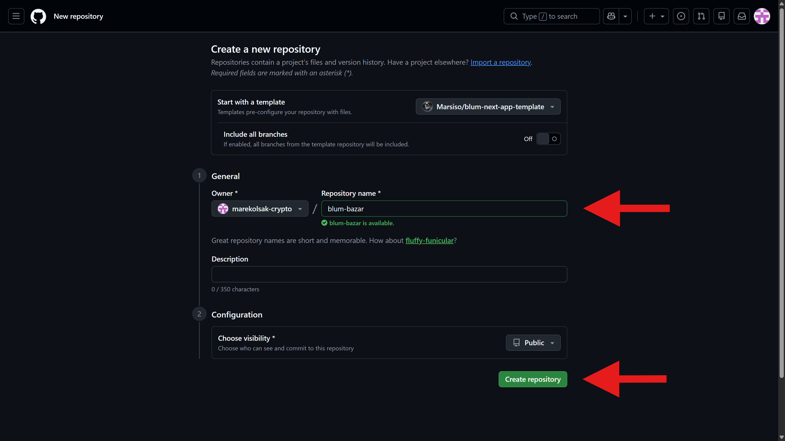

4. Ve svém repozitáří zkopírujte URL repozitáře.

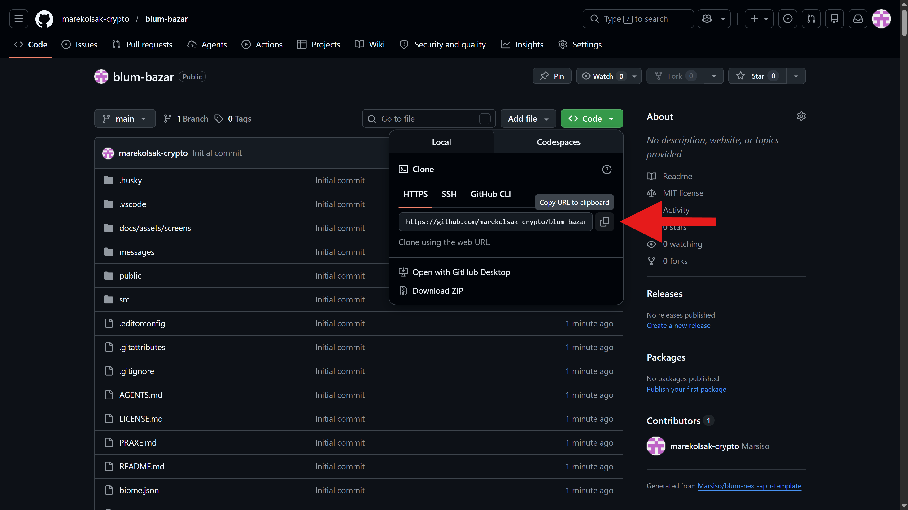

5. Naklonujte projekt do počítače.

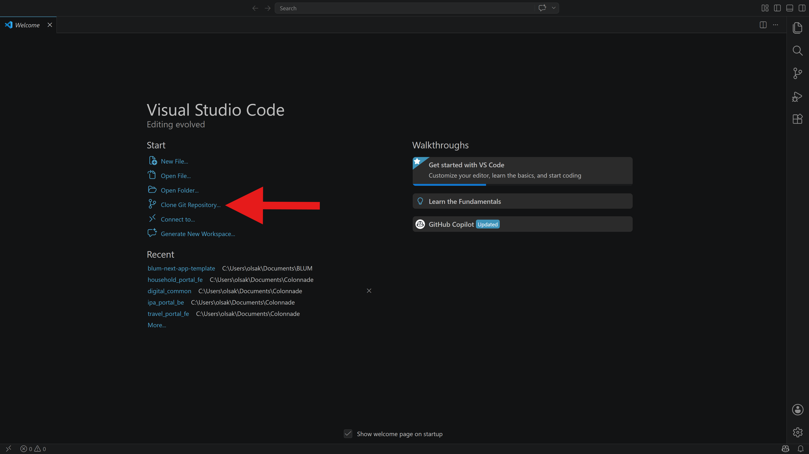

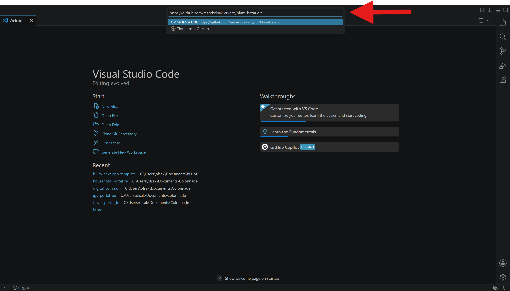

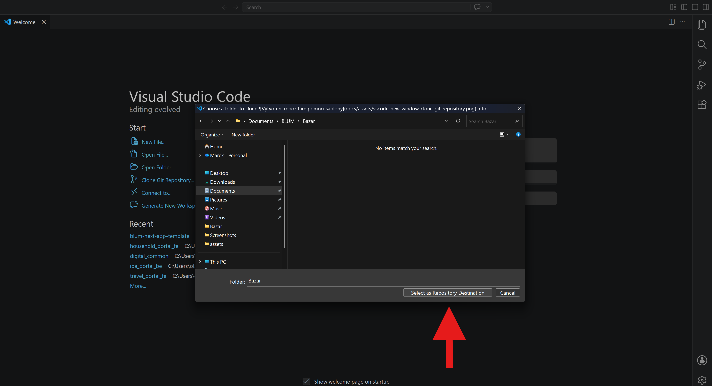

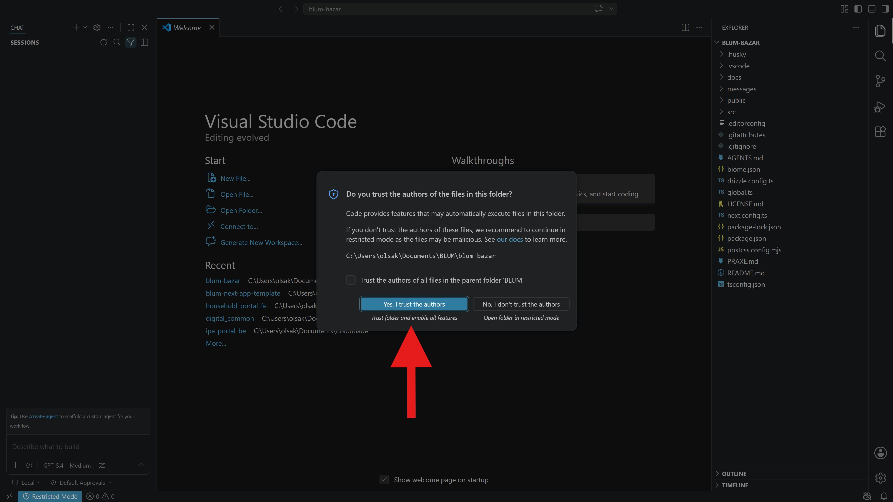

---

## 9. Spuštění projektu

V terminálu ve složce projektu spusťte:

```powershell
npm install
npm run db:migrate
npm run dev
```

Co příkazy dělají:

- `npm install` stáhne knihovny, které projekt potřebuje,
- `npm run db:migrate` připraví lokální databázi, pokud ji šablona používá,
- `npm run dev` spustí vývojový server.

Poté otevřete v prohlížeči:

```text
http://localhost:3000
```

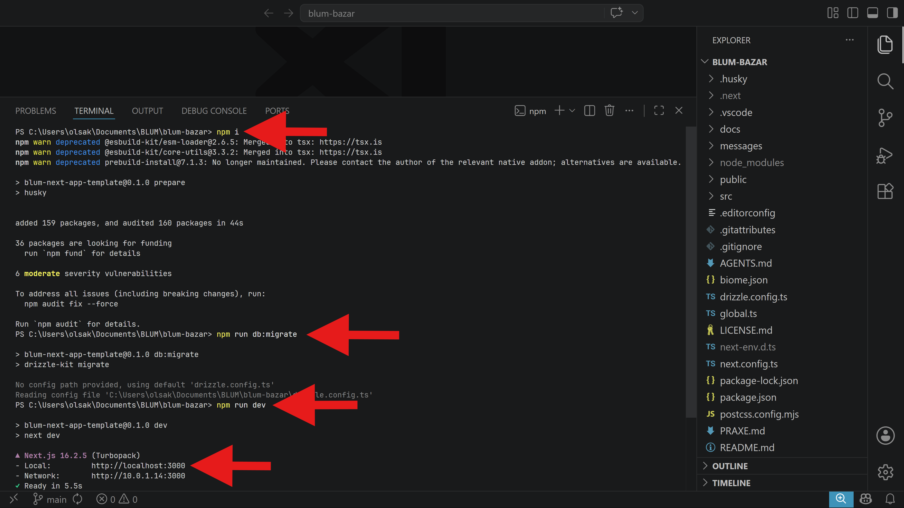

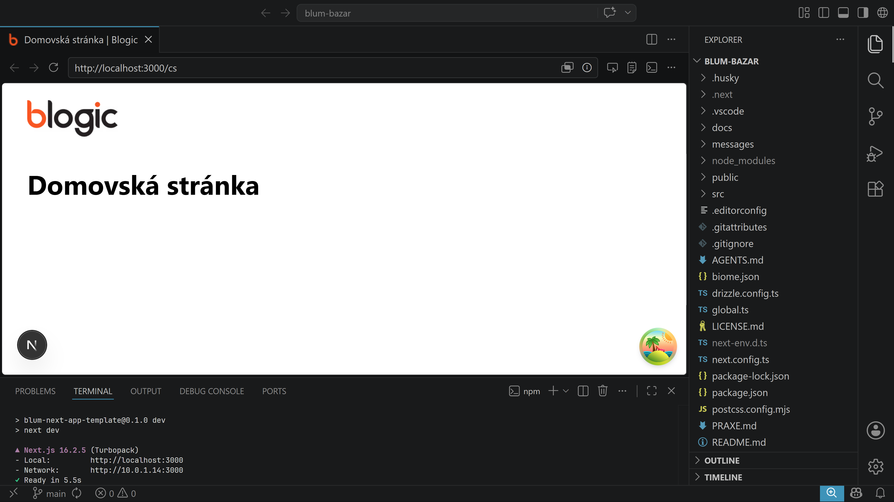

---

## 10. Jak se zorientovat v projektu

Na začátek stačí znát několik základních složek.

```text
src/
  app/          stránky a serverové endpointy
  components/   znovupoužitelné části obrazovky
  db/           databáze a migrace, pokud je projekt používá
messages/       texty aplikace a překlady
public/         obrázky a veřejné soubory
```

### Kde začít hledat

- Stránky hledejte ve složce `src/app/`.
- Opakovaně použitelné části obrazovky hledejte ve složce `src/components/`.
- Texty a překlady mohou být ve složce `messages/`.
- Obrázky, logo nebo veřejné soubory patří do složky `public/`.

### Důležité názvy souborů v Next.js

- `page.tsx` znamená stránku.
- `layout.tsx` znamená společné rozložení pro více stránek.
- `route.ts` znamená serverový endpoint.

Podrobnosti hledejte v oficiální dokumentaci Next.js:

- Project Structure: <https://nextjs.org/docs/app/getting-started/project-structure>
- App Router: <https://nextjs.org/docs/app>
- Route Handlers: <https://nextjs.org/docs/app/api-reference/file-conventions/route>
- Dynamic Routes: <https://nextjs.org/docs/app/api-reference/file-conventions/dynamic-routes>

### Čemu se na začátku nemusíte věnovat

Pokud jen spouštíte projekt a plníte základní zadání, nemusíte hned upravovat:

- konfigurační soubory v kořenové složce projektu,
- databázové migrace,
- pokročilé serverové endpointy,
- části kódu, kterým zatím nerozumíte.

Když si nejste jistí, jestli daný soubor upravovat, zeptejte se mentora.

---

## 11. Mantine UI a návrh obrazovek

Projekt používá **Mantine UI**. Mantine je knihovna hotových React komponent, ze kterých můžete skládat obrazovky aplikace.

Nemusíte si psát všechny prvky od začátku. V dokumentaci Mantine najdete například:

- tlačítka,
- karty,
- formulářová pole,
- badge,
- rozvržení stránky,
- modální okna,
- notifikace.

Oficiální dokumentace:

- Mantine Core: <https://mantine.dev/core/package/>
- Mantine Forms: <https://mantine.dev/form/use-form/>
- Mantine Notifications: <https://mantine.dev/x/notifications/>

Mantine má také hotové šablony a příklady bloků obrazovek:

- Mantine UI šablony: <https://ui.mantine.dev/>

Při práci na bazaru se vám mohou hodit hlavně tyto typy komponent:

- `Card` pro zobrazení jednoho inzerátu,
- `Badge` pro kategorii nebo stav,
- `Button` pro akce,
- `TextInput` a `Textarea` pro formuláře,
- `Select` pro výběr kategorie nebo stavu,
- `Checkbox` pro volbu „zdarma“,
- `SimpleGrid` nebo `Grid` pro rozložení karet,
- `Group` a `Stack` pro uspořádání prvků.

Doporučený postup:

1. Najděte podobný příklad v Mantine dokumentaci nebo v Mantine UI šablonách.
2. Podívejte se, jaké komponenty používá.
3. Využijte stejný princip ve své obrazovce.
4. Neupravujte zbytečně mnoho vlastních stylů.

Cílem je jednoduchá, čitelná a použitelná aplikace, ne složitý design.

---

## 12. Git a GitHub bez stresu

Git slouží k ukládání změn. GitHub slouží k tomu, aby byla vaše práce uložená online a mohla být odevzdána.

Doporučený jednoduchý postup:

1. Vytvořit novou větev.

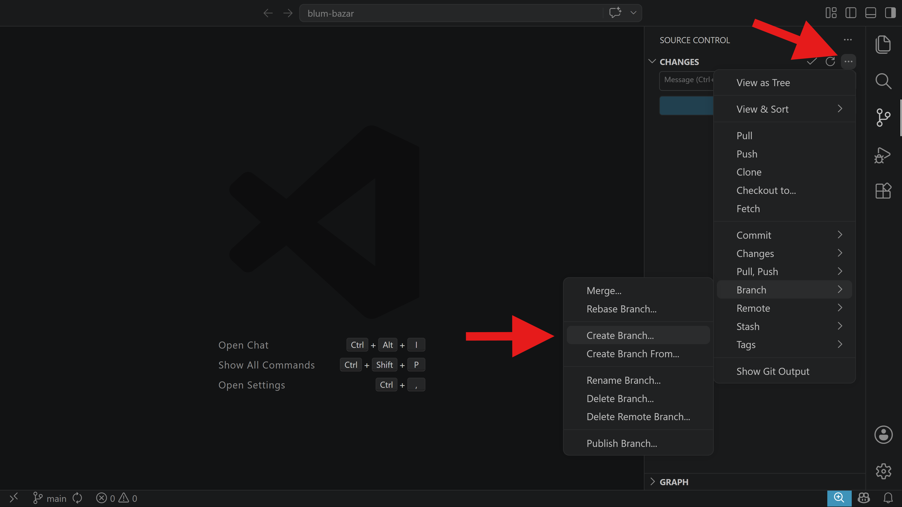

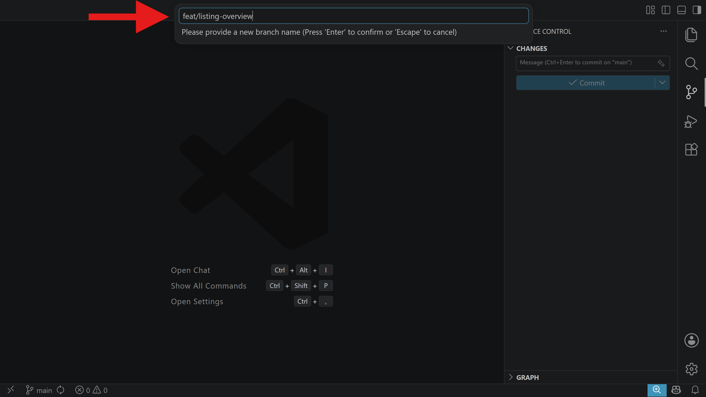

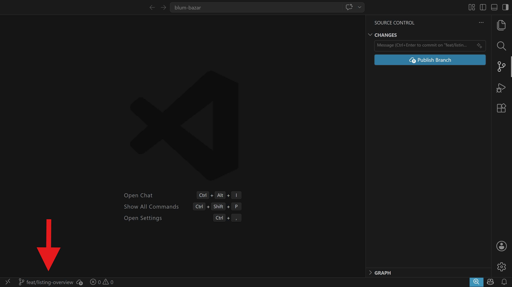

2. Udělat změnu.
3. Zkontrolovat změněné soubory.
4. Vytvořit commit.

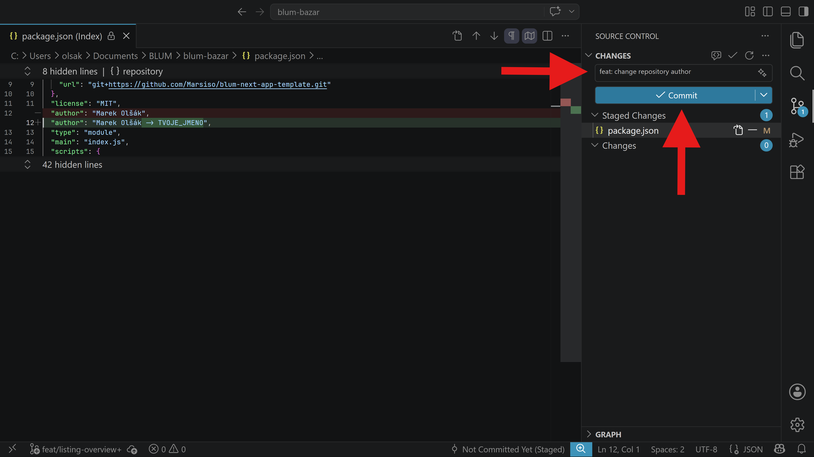

5. Přihlásit se na GitHub ve Visual Studio Code (pokud jste ještě neučinili)

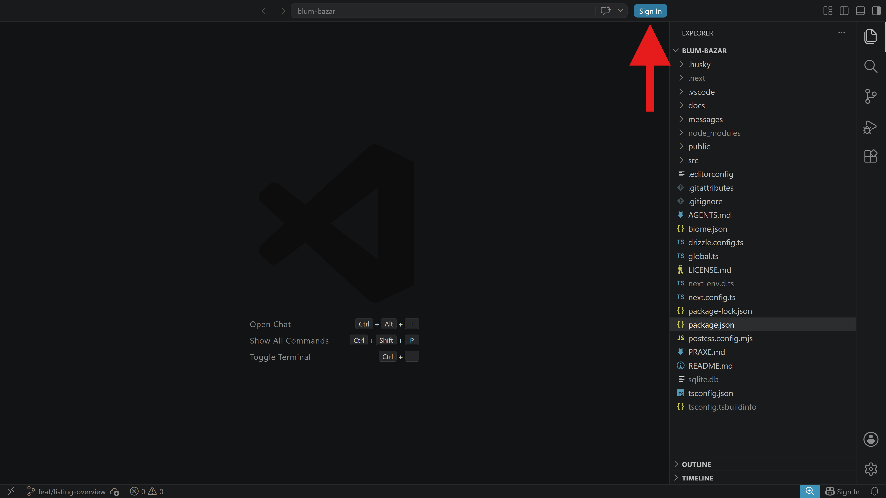

6. Nahrát větev na GitHub.

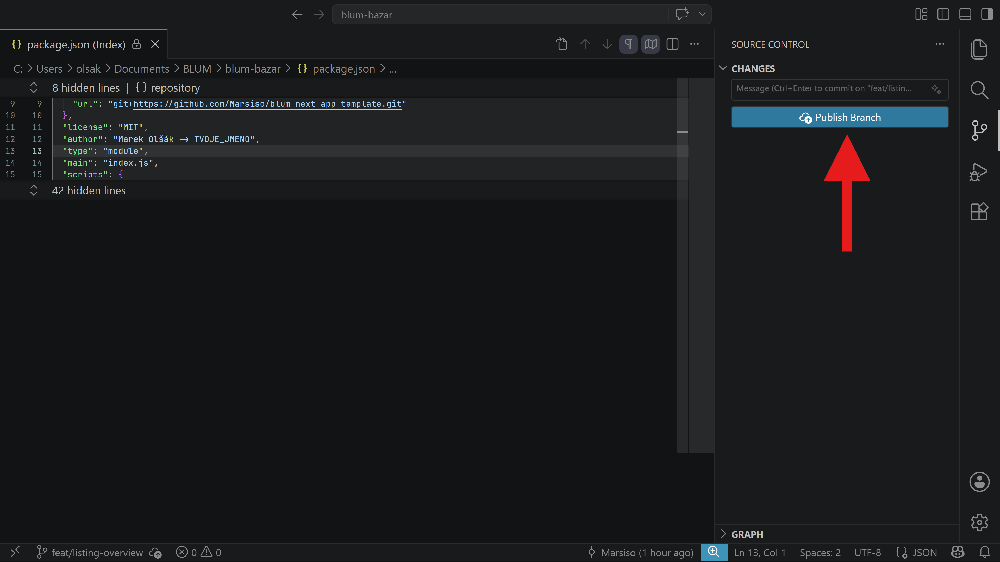

7. Vytvořit pull request.

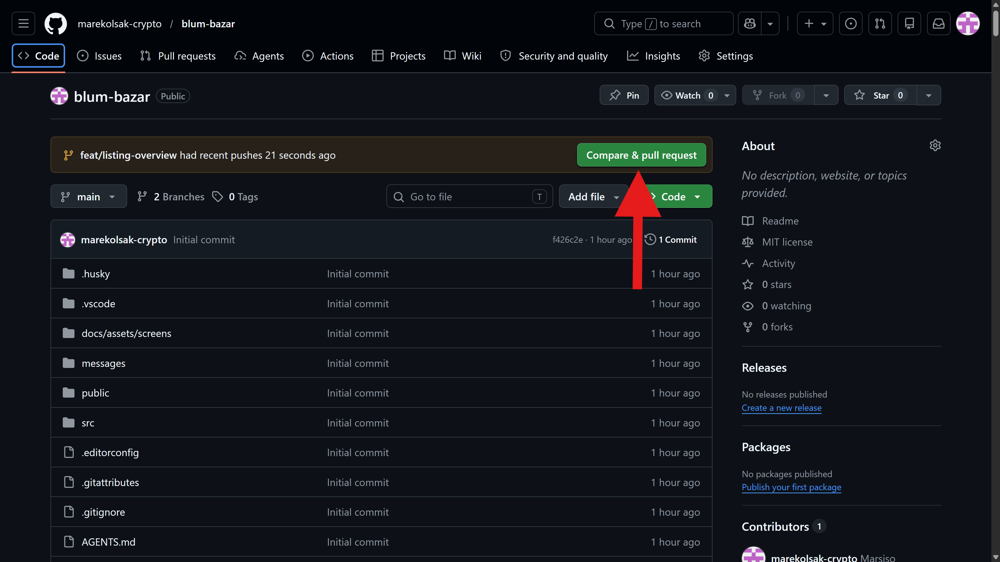

8. Kliknout na tlačítko `Create pull request`.

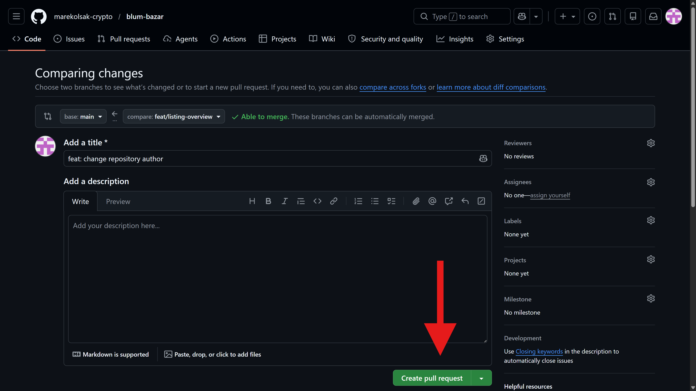

9. Kliknout na tlačítko `Merge pull request`.

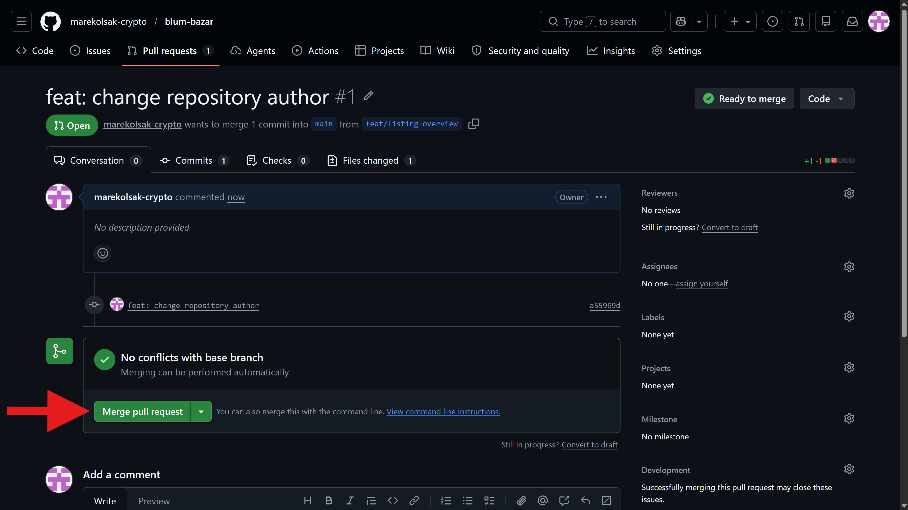

10. Změnit branch na `main`.

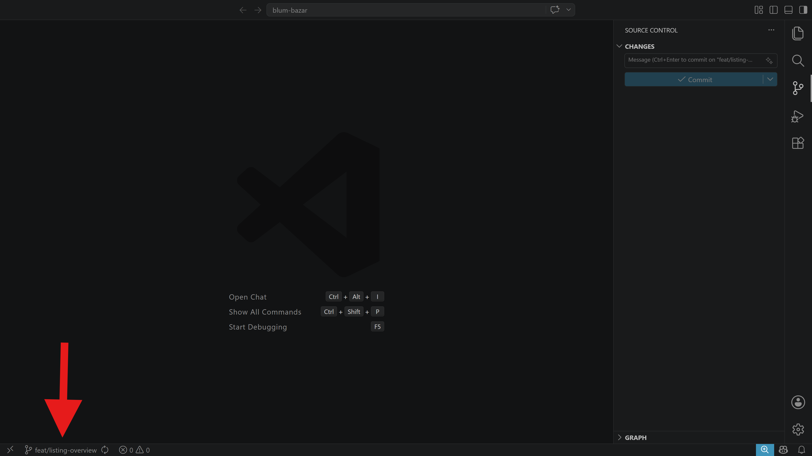

11. Aktualizovat `main` branch.

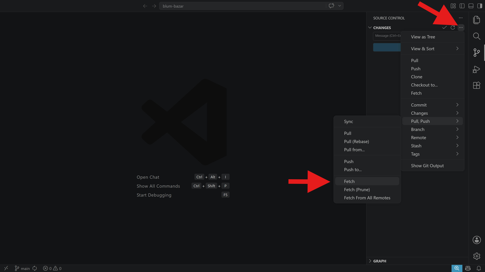

12. Stáhnout nějnovější změny pro `main` branch.

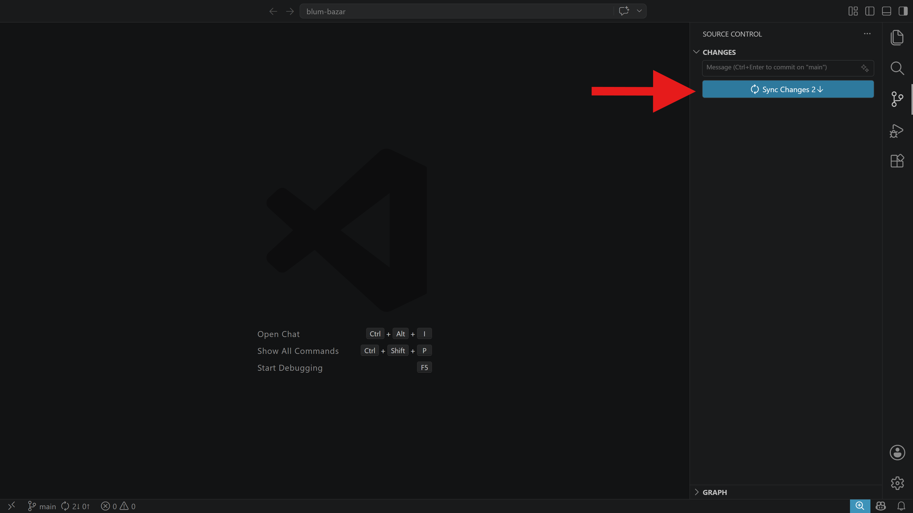

13. Cyklus dokočen, nyní můžete založit novou branch a začít od začátku.

Před commitem nebo pushem může projekt spustit automatickou kontrolu. Pokud se proces zastaví, přečtěte chybovou zprávu a zkuste chybu opravit. Pokud si nejste jistí, pošlete ji mentorovi.

---

## 13. Jak pracovat s dokumentací

Dokumentace není kniha, kterou musíte přečíst od začátku do konce.

Používejte ji jako mapu:

1. Nejprve se podívejte do existujícího kódu v projektu.
2. Najděte podobnou část v oficiální dokumentaci.
3. Zaměřte se hlavně na jednoduché příklady.
4. Vyzkoušejte malou změnu.
5. Pokud chyba trvá, zeptejte se mentora.

Při hledání se ptejte konkrétně:

- Jak v Next.js vytvořím stránku?
- Jak v Mantine zobrazím kartu?
- Jak v Mantine vytvořím formulář?
- Jak v GitHubu vytvořím pull request?

Nepoužívejte náhodné návody bez ověření. Preferujte oficiální dokumentaci nástroje, se kterým pracujete.

---

## 14. Kde hledat další informace

| Téma | Co hledat | Odkaz |
|---|---|---|
| VS Code | instalace a základní práce ve Windows | <https://code.visualstudio.com/docs/setup/windows> |
| Git | instalace a základní nastavení | <https://docs.github.com/en/get-started/git-basics/set-up-git> |
| GitHub fork | vytvoření vlastní kopie repozitáře | <https://docs.github.com/en/pull-requests/collaborating-with-pull-requests/working-with-forks/fork-a-repo> |
| Pull request | odevzdání změn přes GitHub | <https://docs.github.com/articles/creating-a-pull-request-from-a-fork> |
| Node.js | stažení LTS verze | <https://nodejs.org/en/download> |
| Next.js struktura projektu | složka `app`, `page.tsx`, `layout.tsx` | <https://nextjs.org/docs/app/getting-started/project-structure> |
| Next.js App Router | princip routování | <https://nextjs.org/docs/app> |
| Next.js route handlers | serverové endpointy | <https://nextjs.org/docs/app/api-reference/file-conventions/route> |
| Next.js dynamic routes | detail podle ID | <https://nextjs.org/docs/app/api-reference/file-conventions/dynamic-routes> |
| Mantine Core | základní UI komponenty | <https://mantine.dev/core/package/> |
| Mantine Forms | práce s formuláři | <https://mantine.dev/form/use-form/> |
| Mantine Notifications | potvrzení po akci | <https://mantine.dev/x/notifications/> |
| Mantine UI | hotové šablony a bloky obrazovek | <https://ui.mantine.dev/> |
| Better Auth | volitelné přihlášení v Next.js | <https://better-auth.com/docs/integrations/next> |
| Google přihlášení v Better Auth | volitelné Google přihlášení | <https://www.better-auth.com/docs/authentication/google> |
| Google OAuth | vytvoření OAuth klienta | <https://developers.google.com/identity/protocols/oauth2/web-server> |
| Biome | kontrola a formátování kódu | <https://biomejs.dev/reference/vscode/> |
| EditorConfig | jednotné formátování v editorech | <https://editorconfig.org/> |

---

## 15. Tahák pojmů a příkazů

### Krátký slovníček

- **repozitář**: složka projektu sledovaná Gitem,
- **fork**: vaše vlastní kopie repozitáře na GitHubu,
- **clone**: stažení repozitáře do počítače,
- **branch**: větev, tedy oddělená pracovní linka pro změny,
- **commit**: uložený bod v historii změn,
- **pull request**: návrh změny na GitHubu,
- **stránka**: v Next.js typicky soubor `page.tsx`,
- **layout**: společný obal pro více stránek,
- **komponenta**: menší část obrazovky, kterou lze použít opakovaně,
- **endpoint**: serverová část aplikace, která vrací data,
- **UI knihovna**: sada hotových komponent pro tvorbu obrazovek.

---

## Závěr

Tuto příručku berte jako první mapu. Nemá vás naučit všechno najednou. Má vás bezpečně dovést od čistého počítače k první fungující změně v projektu.

Po dokončení praxe byste měli rozumět tomu:

- jak se spouští existující webový projekt,
- jak se v projektu hledají důležité soubory,
- jak vzniká jednoduchá stránka,
- jak se skládá UI z komponent,
- jak se pracuje s formulářem,
- jak se změny ukládají pomocí Gitu,
- jak se práce odevzdává přes GitHub.

To jsou základy, na kterých stojí další studium softwarového inženýrství i praktický vývoj aplikací.
